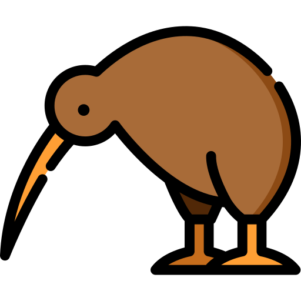

# [](k_img.png) PotatoDB
🥔**PotatoDB** is simple key-value database written on Golang.
## Installation
1. **Build** project:
```sh
go build .
```
2. Create **.env** file like this:
```env
DIR_NAME=YOUR_DB_NAME
ADDRESS=8080
LOG_FILE=potato.log
HOST=localhost
```
3. Run ```./potatoDB```
4. Setup and work with database by http API.

## Routes
> /core<br>
> /filter<br>
> /cluster

## Request
### **/core** (for single-document operations):
#### Get document by id in cluster
> GET:
>```json
>{
> "Cluster": "cluster_name",
>  "Id": "object_id"
>}
>```
#### Create new value in cluster with autogenerated-key:
> POST:
>```json
>{
> "Cluster": "cluster_name",
>  "Value": "object_value"
>}
>```
#### Create new value in cluster with known-key:
>```json
>{
> "Cluster": "cluster_name",
>  "Id": "optional_id",
>  "Value": "object_value"
>}
#### Delete value by id (in cluster, of course):
>
> DELETE:
>```json
>{
>  "Cluster": "cluster_name",
>  "Id": "object_id"
>}
>```
### **/cluster** (for create and delete cluster):
### Create cluster:
> POST:
>```json
>{
>  "Cluster": "cluster_name"
>}
>```
#### Get all documents in cluster:
> GET:
>```json
>{
>  "Cluster": "cluster_name",
>}
#### Delete cluster (***warning! it also delete all documents in cluster!***):
> DELETE:
>```json
>{
>  "Cluster": "cluster_name"
>}
>```
### **/filter** (for get many documents in cluster):
#### Get all documents, which value contain to regex:
> GET:
>```json
>{
>  "Cluster": "cluster_name",
>  "Regex": "regular_expression"
>}
>```
#### Delete all documents, which doesn't contain to regex:
> DELETE:
>```json
>{
>  "Cluster": "cluster_name",
>  "Regex": "regular_expression"
>}
>```
